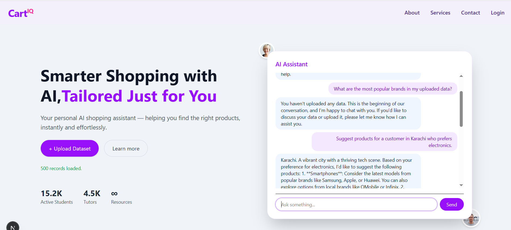
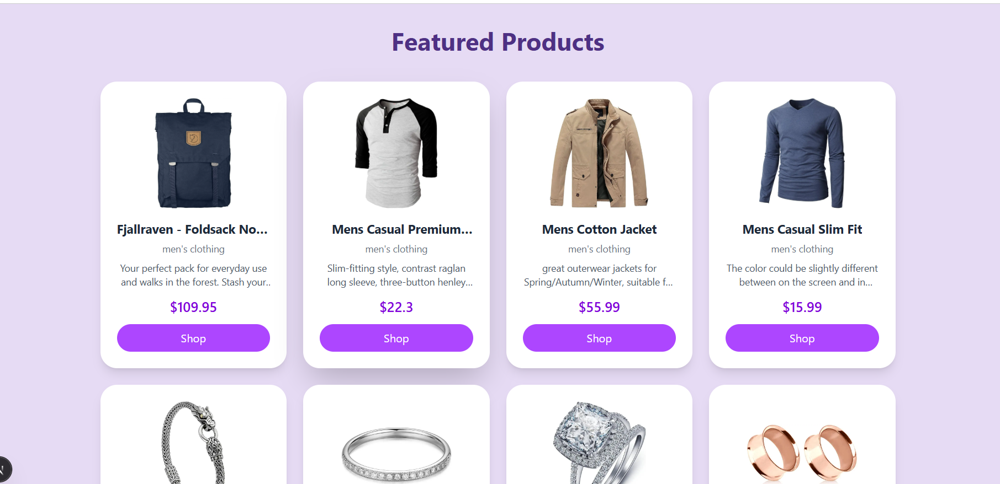

# 🛒 AI-Powered E-Commerce Assistant

Welcome to the **AI-Powered Assistant for E-Commerce** built with **Next.js**, **TypeScript**, **Tailwind CSS**, and **Groq API**. This smart assistant enhances your storefront by providing:
- 📊 Intelligent product recommendations
- 🧠 Natural language understanding
- 📎 Excel-based dataset analysis

Try it out and boost your customers' shopping experience!

---

## 🚀 Features

✅ **AI Chatbot UI** — Fully integrated chat assistant UI on homepage hero section.

✅ **Groq API Integration** — Uses `llama-3-70b-8192` via official Groq SDK for ultra-fast responses.

✅ **Dataset Upload** — Upload your own Excel `.xlsx` file with sales and customer data.

✅ **Contextual Intelligence** — Chatbot can understand and respond based on your uploaded dataset.

✅ **Responsive Design** — Clean, mobile-ready layout using Tailwind CSS.

✅ **Plug and Play** — Drop the component into your homepage to get started.

---

## 🧪 Sample Dataset for Testing

👉 [Download Sample Excel Dataset](https://docs.google.com/spreadsheets/d/1fa0rUwthMFYBsB36fabU4_JNInyufXFsaSAuyaOv2I4/edit?usp=sharing)

Ensure your Excel file includes the following columns:
```
CustomerID, CustomerName, Email, Phone, Location, ProductID, ProductName, Brand, Category, Price, Discount, FinalPrice, Quantity, TotalAmount, PaymentMethod, ShippingStatus, OrderDate
```

---

## 💬 Suggested Prompts

Use the following prompts to test the assistant:

### 📦 Product Suggestions
- "Recommend a product for a customer from Lahore."
- "What are the most common product categories?"
- "Suggest electronics for someone in Karachi."

### 💸 Discount & Price Analysis
- "Which products have the biggest discounts?"
- "List items under 2000 PKR."
- "Top 5 discounted products."

### 📈 Sales Trends
- "Who spent the most in total?"
- "What is the most sold product by quantity?"
- "Which category brings the most revenue?"

### 🧑‍💼 Customer Insights
- "Which customer has the most orders?"
- "List all customers from Islamabad."
- "Who used credit card payment most often?"

### 🚚 Order/Shipping Insights
- "How many orders are pending delivery?"
- "List orders from the last 30 days."

---

## 🧱 Tech Stack
- ⚡ **Next.js 14 App Router**
- 💬 **Groq SDK** (LLaMA 3 model)
- 💄 **Tailwind CSS** for UI
- 📂 **XLSX.js** for Excel parsing
- 🧠 **TypeScript**

---

## 📁 Project Structure
```
src/
├── app/
│   ├── components/
│   │   └── AIChatHero.tsx
│   └── page.tsx
├── api/
│   └── groqClient.tsx
└── app/api/chat/route.ts
```

---

## 🛠 Setup

1. Clone this repo
```bash
git clone https://github.com/your-repo/ecommerce-ai-assistant.git
cd ecommerce-ai-assistant
```

2. Install dependencies
```bash
npm install
```

3. Add your Groq API key in `.env.local`
```env
GROQ_API_KEY=gsk_your_real_key_here
```

4. Run the app
```bash
npm run dev
```

---

## 🧠 Coming Soon
- Streaming responses
- System prompts using dataset
- Enhanced data visualizations
- Voice interaction

---

## 📬 Contact / Feedback
Have ideas or found a bug? PRs are welcome!

> Made with ❤️ using Groq + Next.js
